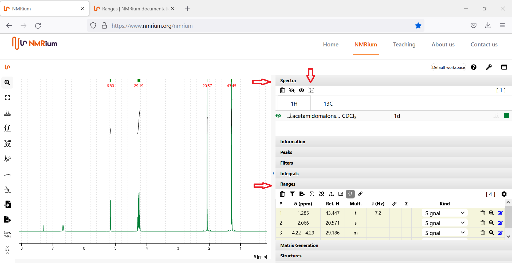

# Ranges

NMRium differentiates between peaks and ranges. A range can contain overlapped signals and can be used for assignments. It is possible to define several individual  signals in a group of overlapping lines. Ranges deliver a combination of signal intensity, center of frequency range (in case of multiplets) and coupling analysis. Peaks only define individual lines.

## Auto ranges picking

NMRium try to find out what are the zones that should be integrated and the multiplicity of each of the zones. For negative signals, the detect negative option needs to be checked. 
Click the Ranges picking button. If your spectrum contains negative signals, set a check mark in the box Detect negative. Then press the Auto ranges picking button. The ranges found by NMRium are listed in the Ranges panel on the right side of the workspace.

 
You can get further information about the selected ranges by opening the panel ranges. Then press shift and alt on the keyboard simultaneously and drag a zone in the spectrum. NMRium shows you the deby information of the coupling constants.  
 
You can also automatically determine the ranges in the panel Spectra . To use this feature, open the panel Spectra on the right side of the workspace and select a core. Click the button "Automatic Ranges/Zones picking for all spectra". The ranges will be determined automatically for all stored spectra of the core. You can find the ranges determined by NMRium in the Ranges panel on the right side of the workspace. 
 

         
## Correction by hand

To correct the selected ranges, open the ranges panel. Then press shift on the keyboard and drag a zone. The system shows the selected zone on the panel and analyses it.

## Edit multiplets manually

## Set a reference

Click the Panel button to the left of the spectrum. Find your solvent signal (or the reference signal). When you point at it with the crosshairs, press the shift key and the left mouse button at the same time. The value of the signal will be shown both in the spectrum and in a list on the right side of the spectrum in the Peaks field. Select one of the two displayed values (in the spectrum single click with the left mouse button, in the list double click with the left mouse button) and enter the correct reference value.

## Specify the sum of integrated protons

The default sum of all integrated protons is 100. To change this sum, click on the sum symbol on the ranges panel. A grey box appears. Enter the total number of integrated protons and click "Set". In the list on the right side, the relative number of protons for the respective integral is indicated.

## Change the value of integration for individual signals

Open the panel ranges. Click rel H for the interessted proton. Then add the new value and press enter. The values of all the other protons also change.

## Further information
